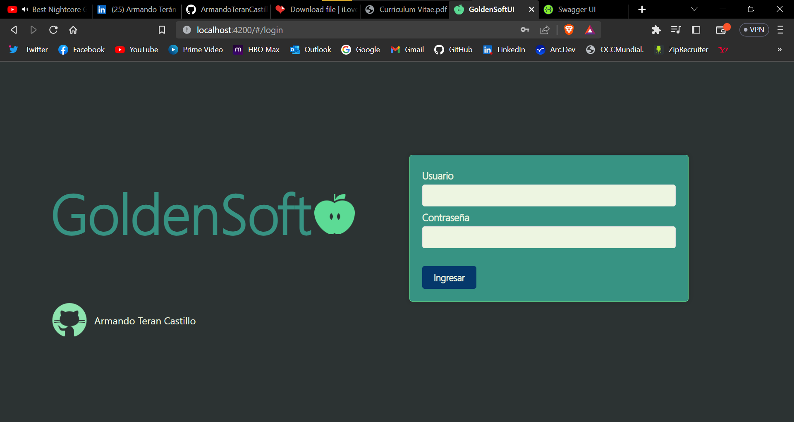

# Sistema de Inventarios para Empresa Manzanera

## Descripcion
Sencillo sistema de administracion de inventario creado en .Net Core 6, Angular y Devextreme
## Autor
Armando Terán Castillo 
* [LinkedIn](https://www.linkedin.com/in/armandoterancastillo/)
* [Github](https://github.com/ArmandoTeranCastillo)
## Instalación
Este proyecto no requiere más que una simple migración en la terminal NuGet en la api .NetCore.
Se puede realizar con los comandos:

> dotnet ef migrate

> dotnet ef database update

## Contratación
Si quieres contratarme, escribeme al correo armandoterancastillo1@outlook.com

## Licencia
MT Public License v.1.0 No puede usarse comercialmente

